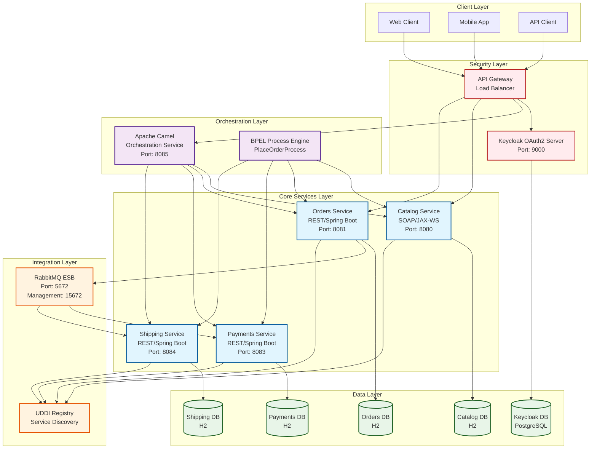
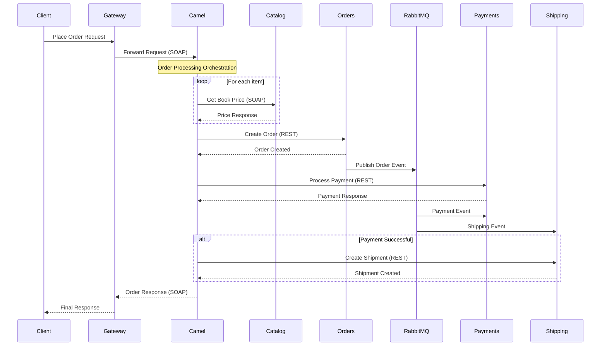
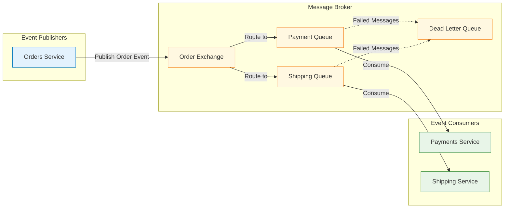
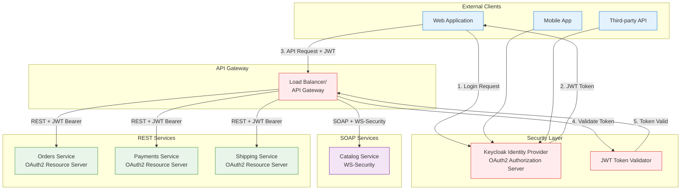
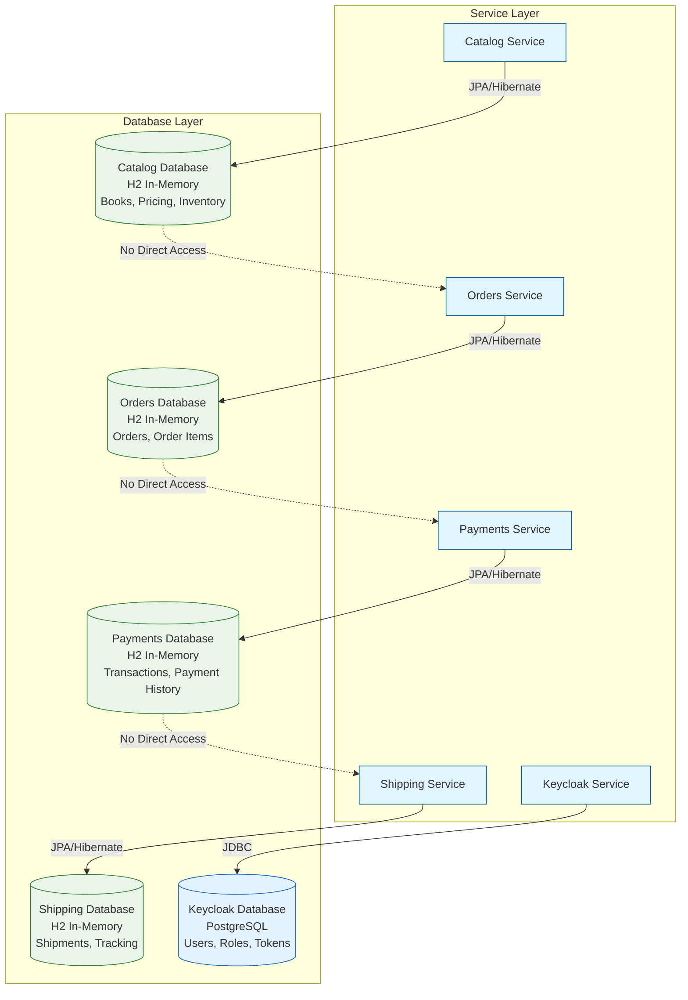
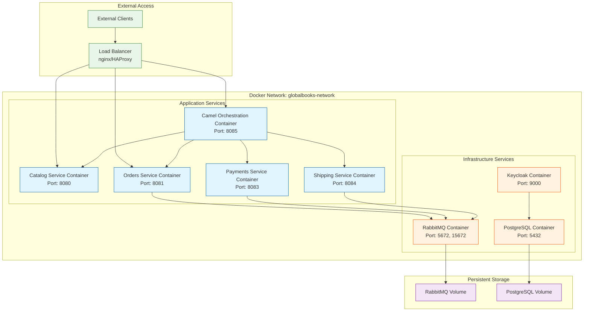
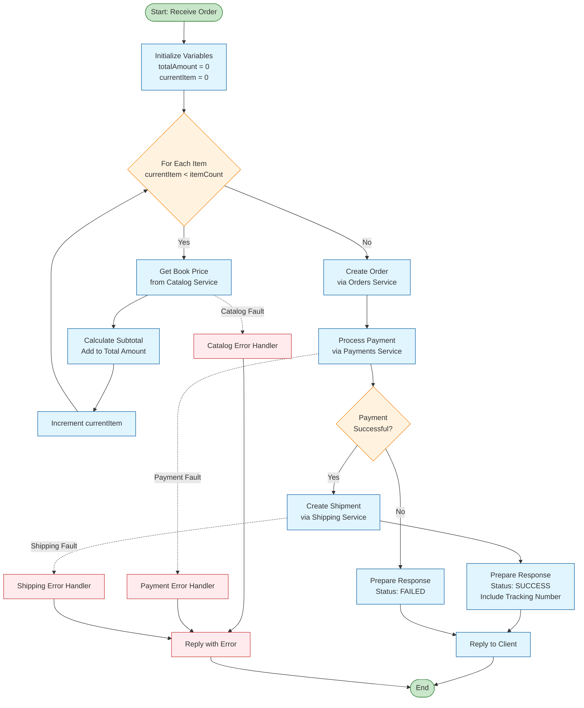

# GlobalBooks SOA System Architecture Diagrams

## 1. Overall System Architecture



## 2. Service Communication Flow



## 3. Message Flow Architecture



## 4. Security Architecture



## 5. Data Architecture



## 6. Deployment Architecture



## 7. BPEL Process Flow



## 8. Technology Stack Layers

```mermaid
graph TB
    subgraph "Presentation Layer"
        WEB[Web UI<br/>HTML/CSS/JavaScript]
        MOBILE[Mobile Apps<br/>iOS/Android]
        API_DOCS[API Documentation<br/>Swagger/OpenAPI]
    end

    subgraph "API Gateway Layer"
        GATEWAY[Load Balancer<br/>nginx/HAProxy]
        RATE_LIMIT[Rate Limiting]
        AUTH[Authentication]
    end

    subgraph "Service Layer"
        SOAP_SVC[SOAP Services<br/>JAX-WS/Spring WS]
        REST_SVC[REST Services<br/>Spring Boot/Spring MVC]
        ORCHESTRATION[Orchestration<br/>Apache Camel/BPEL]
    end

    subgraph "Integration Layer"
        ESB[Enterprise Service Bus<br/>RabbitMQ/AMQP]
        REGISTRY[Service Registry<br/>UDDI]
    end

    subgraph "Security Layer"
        OAUTH[OAuth2/JWT<br/>Keycloak]
        WS_SEC[WS-Security<br/>UsernameToken]
    end

    subgraph "Data Layer"
        ORM[Object-Relational Mapping<br/>JPA/Hibernate]
        H2_DB[In-Memory Database<br/>H2]
        POSTGRES[Relational Database<br/>PostgreSQL]
    end

    subgraph "Infrastructure Layer"
        DOCKER[Containerization<br/>Docker/Docker Compose]
        MONITORING[Monitoring<br/>Spring Actuator]
        LOGGING[Logging<br/>SLF4J/Logback]
    end

    %% Layer connections
    WEB --> GATEWAY
    MOBILE --> GATEWAY
    GATEWAY --> SOAP_SVC
    GATEWAY --> REST_SVC
    SOAP_SVC --> ESB
    REST_SVC --> ESB
    ORCHESTRATION --> SOAP_SVC
    ORCHESTRATION --> REST_SVC
    SOAP_SVC --> WS_SEC
    REST_SVC --> OAUTH
    SOAP_SVC --> ORM
    REST_SVC --> ORM
    ORM --> H2_DB
    ORM --> POSTGRES
    ESB --> DOCKER
    OAUTH --> POSTGRES

    classDef presentationClass fill:#e8eaf6,stroke:#3f51b5
    classDef gatewayClass fill:#f3e5f5,stroke:#9c27b0
    classDef serviceClass fill:#e1f5fe,stroke:#03a9f4
    classDef integrationClass fill:#fff3e0,stroke:#ff9800
    classDef securityClass fill:#ffebee,stroke:#f44336
    classDef dataClass fill:#e8f5e8,stroke:#4caf50
    classDef infraClass fill:#fafafa,stroke:#607d8b

    class WEB,MOBILE,API_DOCS presentationClass
    class GATEWAY,RATE_LIMIT,AUTH gatewayClass
    class SOAP_SVC,REST_SVC,ORCHESTRATION serviceClass
    class ESB,REGISTRY integrationClass
    class OAUTH,WS_SEC securityClass
    class ORM,H2_DB,POSTGRES dataClass
    class DOCKER,MONITORING,LOGGING infraClass