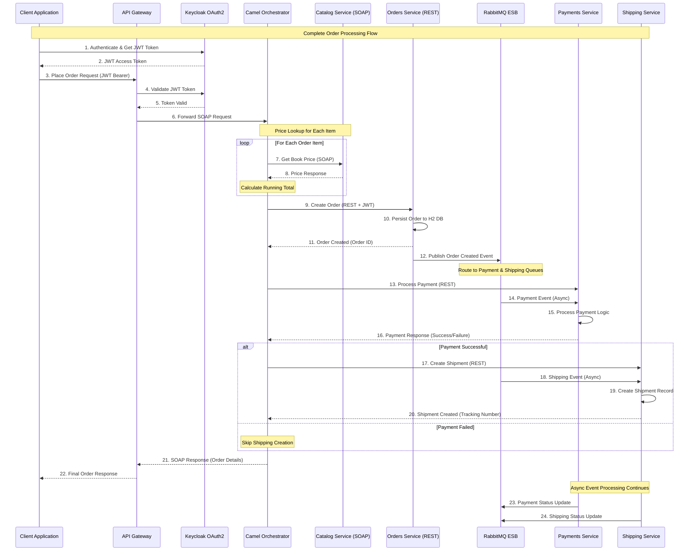
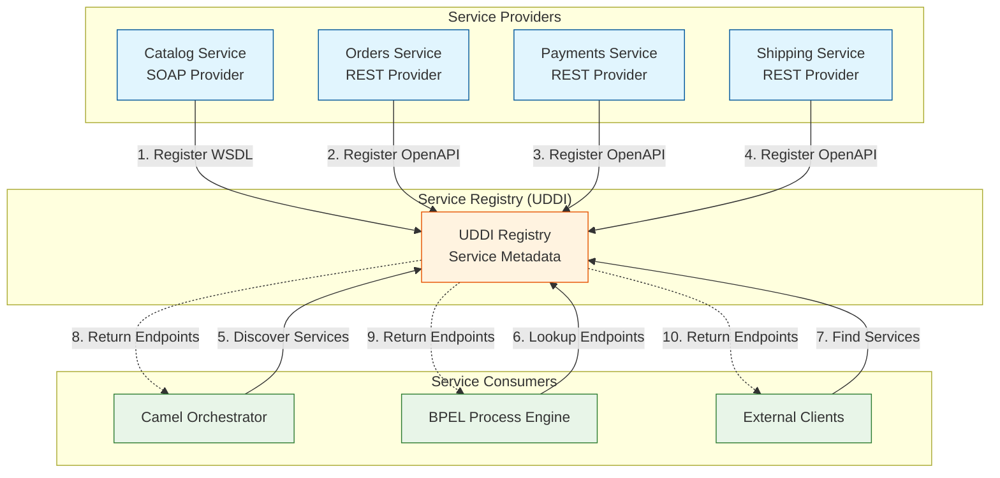
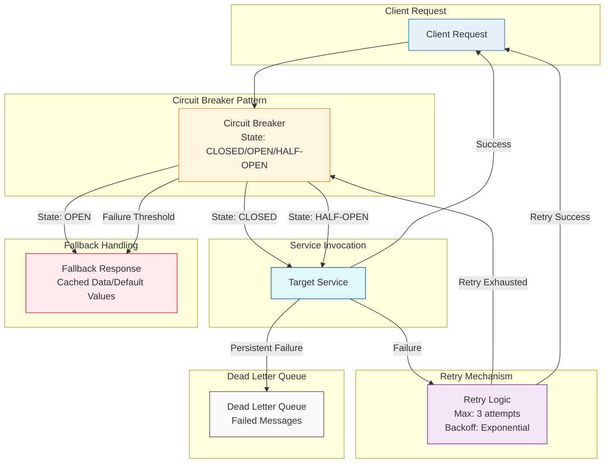
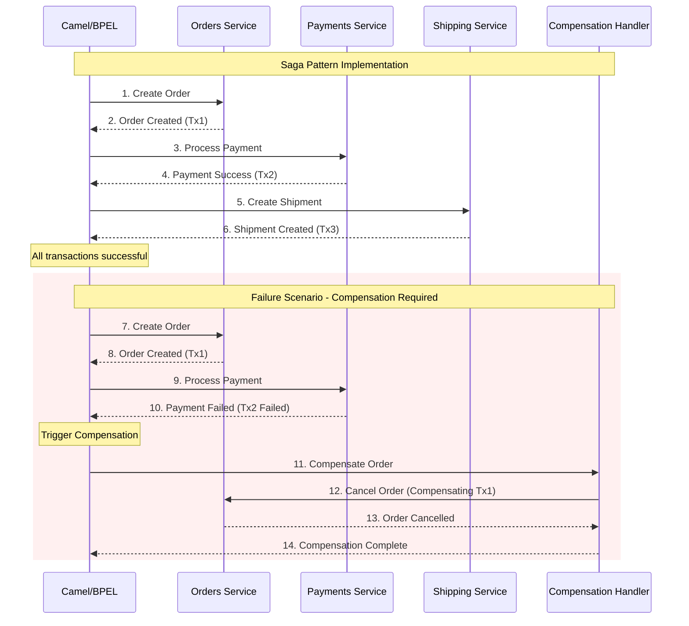
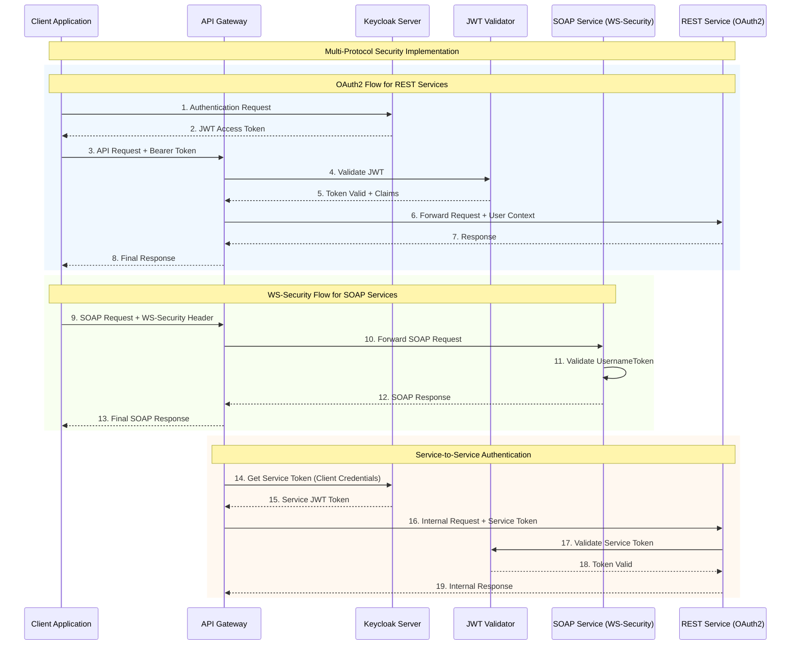
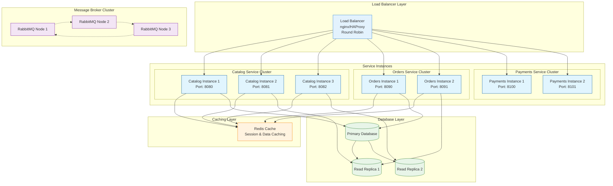

# Service Interaction Diagrams

## 1. Order Processing Workflow (Complete Flow)



## 2. Service Discovery and Registration



## 3. Error Handling and Fault Tolerance



## 4. Data Consistency and Transaction Management



## 5. Security Flow Diagram



## 6. Performance and Scalability Architecture



## 7. Monitoring and Observability

```mermaid
graph TB
    subgraph "Application Services"
        CATALOG[Catalog Service<br/>Spring Actuator]
        ORDERS[Orders Service<br/>Spring Actuator]
        PAYMENTS[Payments Service<br/>Spring Actuator]
        SHIPPING[Shipping Service<br/>Spring Actuator]
    end

    subgraph "Metrics Collection"
        PROMETHEUS[Prometheus<br/>Metrics Server]
        MICROMETER[Micrometer<br/>Metrics Registry]
    end

    subgraph "Logging"
        LOGBACK[Logback<br/>Structured Logging]
        ELK[ELK Stack<br/>Elasticsearch, Logstash, Kibana]
    end

    subgraph "Tracing"
        ZIPKIN[Zipkin<br/>Distributed Tracing]
        JAEGER[Jaeger<br/>Request Tracing]
    end

    subgraph "Visualization"
        GRAFANA[Grafana<br/>Dashboards & Alerts]
        KIBANA[Kibana<br/>Log Analysis]
    end

    subgraph "Health Monitoring"
        HEALTH[Health Check Endpoints<br/>/actuator/health]
        READINESS[Readiness Probes<br/>Kubernetes]
        LIVENESS[Liveness Probes<br/>Kubernetes]
    end

    %% Metrics flow
    CATALOG --> MICROMETER
    ORDERS --> MICROMETER
    PAYMENTS --> MICROMETER
    SHIPPING --> MICROMETER
    MICROMETER --> PROMETHEUS
    PROMETHEUS --> GRAFANA

    %% Logging flow
    CATALOG --> LOGBACK
    ORDERS --> LOGBACK
    PAYMENTS --> LOGBACK
    SHIPPING --> LOGBACK
    LOGBACK --> ELK
    ELK --> KIBANA

    %% Tracing flow
    CATALOG --> ZIPKIN
    ORDERS --> ZIPKIN
    PAYMENTS --> ZIPKIN
    SHIPPING --> ZIPKIN
    ZIPKIN --> JAEGER

    %% Health monitoring
    CATALOG --> HEALTH
    ORDERS --> HEALTH
    PAYMENTS --> HEALTH
    SHIPPING --> HEALTH
    HEALTH --> READINESS
    HEALTH --> LIVENESS

    classDef serviceClass fill:#e1f5fe,stroke:#01579b
    classDef metricsClass fill:#e8f5e8,stroke:#2e7d32
    classDef loggingClass fill:#fff3e0,stroke:#f57c00
    classDef tracingClass fill:#f3e5f5,stroke:#7b1fa2
    classDef visualClass fill:#e3f2fd,stroke:#1976d2
    classDef healthClass fill:#ffebee,stroke:#c62828

    class CATALOG,ORDERS,PAYMENTS,SHIPPING serviceClass
    class PROMETHEUS,MICROMETER metricsClass
    class LOGBACK,ELK loggingClass
    class ZIPKIN,JAEGER tracingClass
    class GRAFANA,KIBANA visualClass
    class HEALTH,READINESS,LIVENESS healthClass